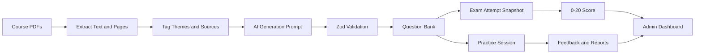

# AI Code Agent Implementation Brief

This document is the build brief for an AI coding agent implementing the Curso de Treinador de Padel Grau I study dashboard.

The project is currently greenfield. The root contains product/domain documentation, source PDFs, and an empty `app/` directory where the application should be built.

## Objective

Build a small study dashboard that helps students prepare for the Curso de Treinador de Padel Grau I exam.

The app must:

- Ingest course materials from presentations and IPDJ manuals.
- Generate multiple-choice questions with AI into a strict schema.
- Store validated candidate questions in a Supabase-backed question bank.
- Assemble 80-question practice exams using the calendar-based theme blueprint.
- Support untimed theme practice.
- Score exams on the Portuguese 0-20 scale.
- Support phone-number OTP login.
- Capture question feedback and support reports.
- Provide an MVP admin dashboard for usage, results, and question quality.

## Source Documentation

Use these docs as the source of truth:

- `CONTEXT.md`: project glossary and domain language.
- `docs/course-material-map.md`: calendar themes, hour weights, and source material mapping.
- `docs/ingestion-pipeline.md`: ingestion and AI generation rules.
- `docs/question-provenance.md`: presentation anchor and manual reference model.
- `docs/exam-behavior.md`: exam, practice, scoring, and answer reveal rules.
- `docs/question-reporting.md`: support and question report payload.
- `docs/admin-dashboard.md`: MVP admin analytics.
- `docs/language-policy.md`: student-facing language rules.
- `docs/adr/`: accepted architecture and product decisions.

Do not replace these decisions unless explicitly asked.

## Recommended Stack

Build inside `app/`.

- Next.js App Router
- TypeScript
- Tailwind CSS
- shadcn/ui
- Supabase Postgres
- Supabase Auth with phone OTP
- Zod for validation
- AI structured outputs for candidate question generation
- Server-side ingestion scripts for PDF extraction and DB insertion

The first implementation should optimize for a working vertical slice, not a polished full product.

## Authentication and SMS Provider

Use Supabase Auth for phone-number OTP in the MVP. This keeps authentication and application data in one platform, which is simpler for a first build.

Important constraint: Supabase phone login does not require the paid Advanced MFA Phone add-on, but real OTP delivery still requires an SMS provider such as Twilio, MessageBird, Vonage, or TextLocal. SMS delivery may become paid depending on provider usage. For MVP development, keep auth code simple and isolated enough that the SMS provider can be changed later.

Implementation rule:

- Supabase Auth owns phone OTP and user sessions.
- Supabase Postgres owns application data.
- On first login, create or update a `student_profiles` row keyed by Supabase Auth user ID.
- Server-side routes/actions should verify the Supabase session before reading or writing student-owned data.

## High-Level Architecture



## Build Principles

- Build a thin end-to-end slice before expanding scope.
- Keep AI generation separate from deterministic validation and persistence.
- Never insert malformed AI output into the database.
- Preserve source provenance for every question.
- Prefer boring, explicit database tables over clever abstractions.
- Student-facing UI and generated content must be in Portuguese.
- Internal developer docs and code comments may be in English.

## Course Theme Blueprint

The calendar is the source of truth for exam weighting.

Current 80-question target:

- `PDD`: 33 questions
- `TMTD`: 27 questions
- `FCH`: 7 questions
- `FCH - Doping`: 5 questions
- `ED`: 4 questions
- `DA`: 4 questions

Use deterministic largest-remainder rounding with a minimum of four questions per taught theme. For the current calendar, tied two-hour themes resolve by first occurrence in the calendar, giving the extra question to `FCH - Doping`.

## Source Material Mapping

Presentations:

- `PDD`: `CG1 - Federac?a?o Portuguesa Padel_Pedagogia e Dida?tica do Desporto (completo).pdf`
- `TMTD`: `Teoria_Metodologia_TD1_26.pdf`, `Teoria_Metodologia_TD2_26.pdf`, `CG1 - Federac?a?o Portuguesa Padel - MT (2026).pdf`
- `FCH`: `CG1 - Federac?a?o Portuguesa Padel - FCH.pdf`
- `FCH - Doping`: `FORMAC?A?O ADoP - PADEL 2025.pdf`
- `ED`: `CG1 - Federac?a?o Portuguesa Padel - E?tica.pdf`
- `DA`: `CURSO_TRE_NIVEL_1_PA_007.pdf`

Manuals:

- `PDD`: `PEDAGOGIA DIDATICA DESPORTO_GI.pdf`
- `TMTD`: `TEORIA METODOLOGIA DO TREINO_GI.pdf`
- `FCH`: `FUNCIONAMENTO CH ANTIDOPAGEM_GI.pdf`
- `FCH - Doping`: `FUNCIONAMENTO CH ANTIDOPAGEM_GI.pdf`
- `ED`: `ETICA NO DESPORTO_GI.pdf`
- `DA`: `DESPORTO ADAPTADO_GI.pdf`

Important nuance: `FUNCIONAMENTO CH ANTIDOPAGEM_GI.pdf` spans both `FCH` and `FCH - Doping`; split or tag chunks by subtopic.

## Suggested Database Model

Create Supabase migrations for these tables.

### `course_themes`

- `id`
- `code`
- `name`
- `calendar_hours`
- `exam_question_target`
- `sort_order`

### `source_materials`

- `id`
- `theme_id`
- `kind`: `presentation` or `manual`
- `file_name`
- `file_path`
- `title`
- `status`
- `created_at`

### `source_chunks`

- `id`
- `source_material_id`
- `theme_id`
- `page_start`
- `page_end`
- `section_title`
- `content`
- `embedding` optional for later semantic search
- `created_at`

### `generation_batches`

- `id`
- `theme_id`
- `source_scope`
- `model`
- `prompt_version`
- `status`
- `raw_output`
- `created_at`

### `questions`

- `id`
- `theme_id`
- `generation_batch_id`
- `source_scope`
- `prompt`
- `correct_option_index`
- `explanation`
- `status`: `unreviewed`, `approved`, `rejected`, `weakly_sourced`, `source_conflict`
- `presentation_anchor_material_id`
- `presentation_anchor_page`
- `manual_reference_material_id`
- `manual_reference_page`
- `manual_reference_section`
- `quality_flags`
- `created_at`
- `updated_at`

### `question_options`

- `id`
- `question_id`
- `option_index`
- `text`
- `justification`

### `exam_attempts`

- `id`
- `student_id`
- `source_scope`
- `started_at`
- `submitted_at`
- `expires_at`
- `score_0_20`
- `passed`
- `blueprint_snapshot`

### `exam_attempt_questions`

- `id`
- `exam_attempt_id`
- `question_id`
- `position`
- `theme_id`
- `question_snapshot`

### `exam_attempt_answers`

- `id`
- `exam_attempt_question_id`
- `selected_option_index`
- `is_correct`
- `answered_at`

### `question_feedback`

- `id`
- `student_id`
- `question_id`
- `exam_attempt_id`
- `value`: `thumbs_up` or `thumbs_down`
- `created_at`

### `support_reports`

- `id`
- `student_id`
- `question_id` nullable
- `exam_attempt_id` nullable
- `kind`: `bug` or `suggestion`
- `message`
- `question_context` JSONB nullable
- `created_at`

### `student_profiles`

- `id`
- `auth_user_id`
- `phone`
- `role`: `student` or `admin`
- `created_at`

## AI Candidate Question Schema

The AI generation step must return structured data that validates before import.

Recommended Zod shape:

```ts
const CandidateQuestionSchema = z.object({
  themeCode: z.enum(["PDD", "TMTD", "FCH", "FCH_DOPING", "ED", "DA"]),
  sourceScope: z.enum(["presentations_only", "full_materials"]),
  presentationAnchor: z.object({
    fileName: z.string(),
    page: z.number().int().positive(),
    excerpt: z.string().min(1),
  }),
  manualReference: z
    .object({
      fileName: z.string(),
      page: z.number().int().positive().optional(),
      sectionTitle: z.string().optional(),
      excerpt: z.string().optional(),
    })
    .nullable(),
  prompt: z.string().min(1),
  options: z.array(
    z.object({
      text: z.string().min(1),
      justification: z.string().optional(),
    })
  ).length(4),
  correctOptionIndex: z.number().int().min(0).max(3),
  explanation: z.string().min(1),
  qualityFlags: z.array(
    z.enum(["weak_manual_reference", "source_conflict", "uses_all_of_above", "uses_none_of_above"])
  ),
});
```

Use `FCH_DOPING` in code if enum values cannot contain spaces or hyphens, but display it as `FCH - Doping` in the UI.

## AI Prompt Contract

The generation prompt should instruct the model to:

- Write questions in Portuguese.
- Generate exam-style multiple-choice questions with exactly four options.
- Use the presentation anchor as the reason the question belongs in the corpus.
- Use the manual reference to justify the correct answer.
- Prefer questions likely to appear in the real exam.
- Include plausible distractors.
- Use "all of the above" or "none of the above" sparingly.
- When using all/none style options, justify every option.
- Flag weak manual references instead of inventing citations.
- Flag source conflicts instead of resolving them silently.
- Return only structured output matching the schema.

## Ingestion Pipeline Phases

1. Extract PDF text with page numbers.
2. Create `source_materials` records.
3. Create `source_chunks` records.
4. Map chunks to calendar themes.
5. For one theme, assemble prompt inputs from presentation anchors and matching manual chunks.
6. Call AI structured generation.
7. Validate with Zod.
8. Detect duplicates.
9. Insert `generation_batches`, `questions`, and `question_options`.
10. Show inserted candidates in an admin review list.

Start with `ED` or `DA` because they are small and easier to inspect.

## Exam Rules

Full exam:

- 80 questions.
- 90-minute timer.
- Four options per question.
- Score is `correct_answers * 0.25`.
- Pass threshold is `9.5`.
- Correct answers and explanations shown only after submit or timer expiry.

Practice session:

- Untimed.
- Theme-specific.
- Immediate answer and explanation reveal after each answer.
- Still supports feedback and question reporting.

Exam assembly:

- Follow the blueprint by theme.
- Build a fresh randomized attempt each time.
- Save a stable attempt snapshot.
- Prefer questions the student has seen less often.
- Fall back to repeats if a theme lacks enough available questions.

## Student UI MVP

Implement these screens first:

- Login with phone OTP.
- Student dashboard.
- Start full exam.
- Select theme practice.
- Question screen.
- Result screen.
- Question explanation view.
- Support bubble/report form.

Keep UI simple. Use shadcn/ui components for cards, buttons, forms, dialogs, and tables.

## Admin MVP

Implement these admin screens:

- User count and student list.
- Completed exam attempt list.
- Attempt details with score, pass/fail, source scope, and blueprint snapshot.
- Average score per student.
- Aggregate performance by theme.
- Reported and thumbs-down questions.
- Basic question review list for unreviewed, weakly sourced, and source conflict questions.

## Implementation Milestones

### Milestone 1: App scaffold

Create the Next.js app in `app/`, configure TypeScript and Tailwind, and render a simple landing page.

### Milestone 2: Data and auth foundation

Add Supabase env configuration, Supabase clients, Supabase Auth phone OTP notes, database migrations, and seed data for course themes and blueprint.

### Milestone 3: Question bank without AI

Create the schema and manually seed a few sample questions to prove exam assembly, scoring, and result screens.

### Milestone 4: One-theme AI ingestion

Implement PDF extraction and AI candidate generation for one small theme. Validate output and insert candidates.

### Milestone 5: Student exam and practice

Build OTP auth, full exam attempts, theme practice sessions, answer capture, scoring, and explanations.

### Milestone 6: Feedback and admin

Add thumbs up/down, support reports, and the admin MVP dashboards.

### Milestone 7: Expand ingestion

Run ingestion for every theme and tune prompts only where needed.

## First Prompt For AI Coding Agent

Use this as the first implementation prompt:

```text
We are building the Curso de Treinador de Padel Grau I study dashboard. Read `CONTEXT.md` and all docs under `docs/`, especially `docs/ai-agent-implementation/IMPLEMENTATION_BRIEF.md`.

Start Milestone 1 only: create a Next.js App Router project inside `app/` with TypeScript and Tailwind. Build a minimal Portuguese landing page with two disabled cards: "Simular Exame" and "Praticar por Tema". Add a clean folder structure for components, lib, and future ingestion scripts. Do not implement Supabase, auth, or ingestion yet. After scaffolding, run the default checks and report how to start the app.
```

## Second Prompt For AI Coding Agent

After Milestone 1 works:

```text
Implement Milestone 2. Add Supabase configuration placeholders, Supabase Auth phone OTP setup notes, SQL migrations for the MVP schema, and seed data for the six course themes and 80-question blueprint defined in `docs/course-material-map.md`. Do not build the full UI yet. Include clear setup instructions for required environment variables and SMS provider configuration.
```

## Third Prompt For AI Coding Agent

After the database exists:

```text
Implement Milestone 3. Add a small sample question seed for one theme, then build the full exam assembly service using the blueprint and saved attempt snapshots. Use repeat suppression if there is student history, but allow fallback repeats when the bank is small. Add basic tests for scoring and blueprint selection.
```

## Non-Goals For The First Build

- Full admin upload/document management UI.
- Perfect PDF extraction for every file.
- Deep per-question heatmaps.
- Bilingual UI.
- Native mobile app.
- Payment flows.
- Complex roles beyond student/admin.

## Acceptance Criteria For MVP

The MVP is acceptable when:

- A student can log in with phone OTP.
- A student can complete an 80-question timed exam from stored questions.
- A student receives a 0-20 score and pass/fail result.
- A student can practice by theme with immediate explanations.
- Questions keep presentation anchor and manual reference data.
- The app can ingest at least one theme through AI structured output and DB import.
- A student can report a question with full question context attached.
- An admin can see users, attempts, theme performance, and reported/thumbs-down questions.
